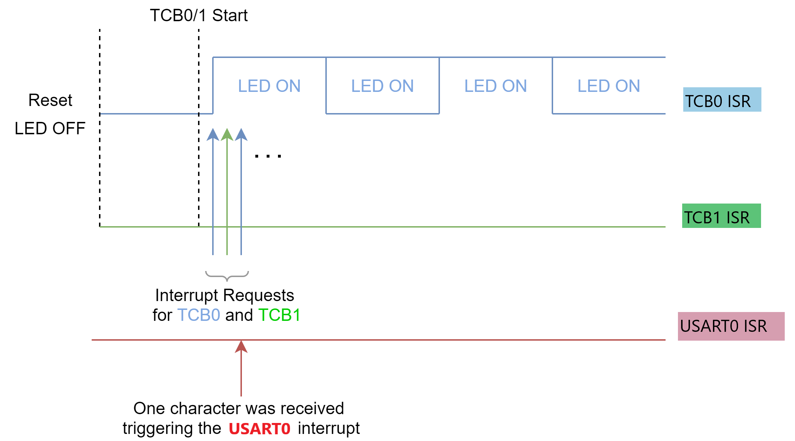
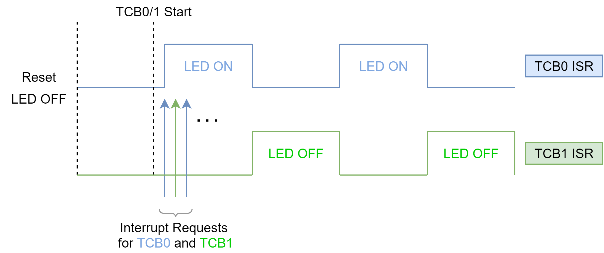
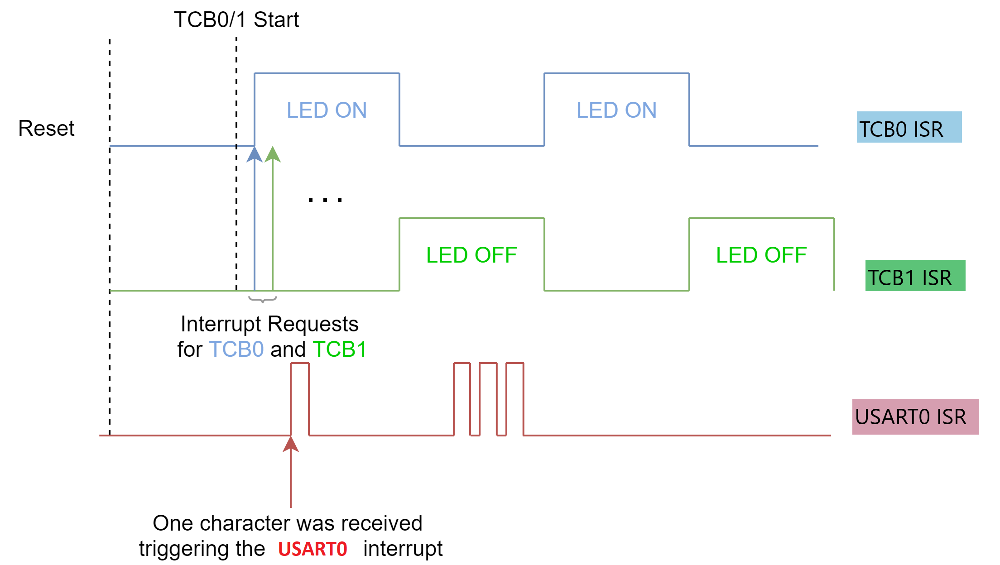
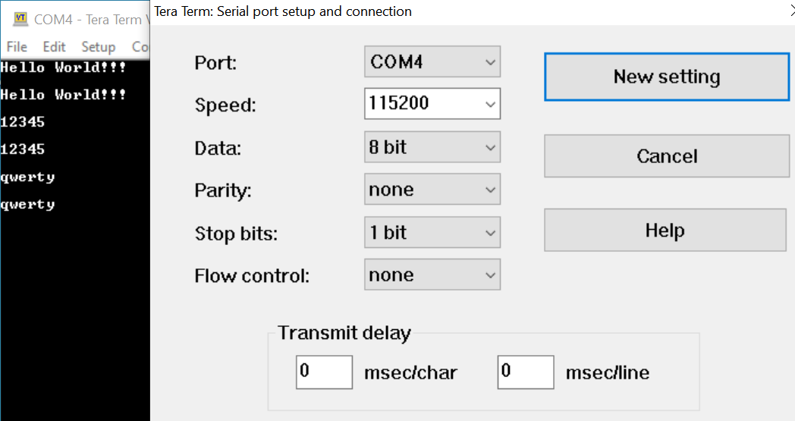
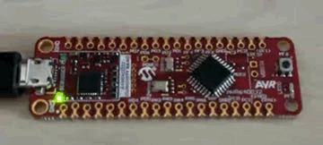

<!-- Please do not change this html logo with link -->

# CPU Interrupt Priorities Using the AVR64DD32 Microcontroller

This project demonstrates the interrupt handling features of the AVR® CPU, highlighting the round robin feature and the high-priority (level 1) interrupt feature. Three interrupts are enabled: capture interrupt for TCB0, capture interrupt for TCB1, and the receive interrupt for USART. The capture interrupt triggers when the timer reaches the TOP value.

## Related Documentation

More details and code examples on the AVR64DD32 can be found at the following links:

- [AVR64DD32 Product Page](https://www.microchip.com/wwwproducts/en/AVR64DD32)
- [AVR64DD32 Code Examples on GitHub](https://github.com/microchip-pic-avr-examples?q=AVR64DD32)
- [AVR64DD32 Project Examples in START](https://start.atmel.com/#examples/AVR64DD32CuriosityNano)

## Software Used

- [MPLAB® X IDE](http://www.microchip.com/mplab/mplab-x-ide) v6.00 or newer
- [MPLAB® XC8](http://www.microchip.com/mplab/compilers) v2.36 or newer
- [AVR-Dx Series Device Pack](https://packs.download.microchip.com/) v2.1.152 or newer

## Hardware Used

- The AVR64DD32 Curiosity Nano Development Board is used as a test platform.
   

## Operation

To program the Curiosity Nano board with this MPLAB® X project, follow the steps provided in the [How to Program the Curiosity Nano Board](#how-to-program-the-curiosity-nano-board) chapter.  

## Setup

The following configurations must be made for this project:

- System clock is 4 MHz
- TCB0
  - Compare value (CCMP) – 10 (2.75 us)
  - Timer enabled
  - Capture interrupt enabled
- TCB1
  - Compare value (CCMP) – 20 (5.25 us)
  - Timer enabled
  - Capture interrupt enabled
- USART0
  - Baud Rate: 115200
  - RX and TX enabled
  - RX interrupt enabled
  - PD4 (TX pin) configured as output and PD5 (RX pin) as input
- CPUINT
  - Round robin convention for interrupt priorities enabled
  - Priority level 1 configured for USART0
- Global interrupts are enabled

| Pin |       Configuration        |
| :-: | :------------------------: |
| PF5 |   LED0 – Digital output    |
| PD4 | USART0 TX – Digital output |
| PD5 | USART0 RX – Digital input  |

## Demo

When using the RXC interrupt while the TCB0/1 Interrupt Service Routine (ISR) is executed, the on-board LED is turned on/off with a 1s delay. The USART0 RXC ISR implements an echo response, transmitting the received character through USART0.

The static scheduling may prevent some interrupt requests from being serviced, as they will always be serviced according to their vector number.
The vector numbers for TCB0, TCB1, and USART0 are provided below.

| Vector Number |     Peripheral Source     |
| :-----------: | :-----------------------: |
|      14       |      TCB0 – Capture       |
|      15       |      TCB1 – Capture       |
|      21       | USART0 – Receive complete |

Without round robin enabled, only the interrupt with the lowest vector number is serviced, as presented below.

 

To avoid this, the CPUINT (CPU interrupt) offers round robin scheduling for normal-priority (level 0) interrupts. In the round robin scheduling, a register is used to store the last acknowledged interrupt vector number. This register ensures that the last acknowledged interrupt vector gets the lowest priority and is automatically updated by the hardware.

In this application, the round robin scheduling is enabled to make sure both TCB0 and TCB1 capture interrupts are serviced.

 

Additionally, the USART0 RXC interrupt is provided with level 1 priority, making it able to interrupt any level 0 interrupt. This is needed in some cases in which other interrupt routines are complex. The user needs to make sure that one important interrupt is not postponed or important data are not lost. The result is explained in the image below.

 

Four test messages are transmitted through USART0 (to the MCU) and transmitted back by the MCU (echo). They are provided in the image below.

- USART0 Echo Messages – Terminal Window
   

The USART0 characters are correctly transmitted back by the MCU, and the LED is continuously turning on and off.

The round robin feature is demonstrated by the LED blinking sequence (both level 0 priority ISRs are executed). The USART0 RXC interrupt being assigned with level 1 priority is demonstrated by the fact that all characters are received and transmitted (there is no data loss).

 

## Summary

This code example demonstrates the usage of CPU interrupt scheduling features – round robin and interrupt level 1 priority.

## How to the Program Curiosity Nano Board

This chapter shows how to use the MPLAB® X IDE to program an AVR® device with an Example_Project.X. This can be applied to any other projects.

- Connect the board to the PC

- Open the Example_Project.X project in MPLAB® X IDE

- Set the Example_Project.X project as main project

  - Right click the project in the **Projects** tab and click **Set as Main Project**
     

- Clean and build the Example_Project.X project

  - Right click the **Example_Project.X** project and select **Clean and Build**
     

- Select **AVRxxxxx Curiosity Nano** in the Connected Hardware Tool section of the project settings:

  - Right click the project and click **Properties**
  - Click the arrow under the Connected Hardware Tool
  - Select **AVRxxxxx Curiosity Nano** (click the **SN**), click **Apply** and then **OK**
     

- Program the project to the board
  - Right click the project and click **Make and Program Device**
     

 

- [Back to Setup](#setup)
- [Back to Demo](#demo)
- [Back to Summary](#summary)
- [Back to top](#cpu-interrupt-priorities-using-the-avr64dd32-microcontroller)
